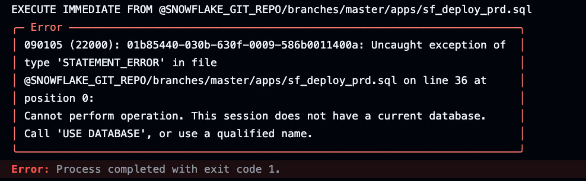

# Problems using EXECUTE IMMEDIATE FROM

The desire is to use Github Actions with "EXECUTE IMMEDIATE FROM" to orchestrate our deployments.  

The issue seems to be around the way in which I'm parameterizing my scripts using SET statements.  My SET statements create variables to give us a level  of abstraction that will support a robust orchestration and deployment model in a multi-user/multi-team environment.


## Details of failure
- The goal is ...

When a commit to the repository happens Github Actions [triggers main.yml](/.github/workflows/main.yml).  Then main.yml calls:  
&nbsp;&nbsp;&nbsp;&nbsp;&nbsp;&nbsp;&nbsp;&nbsp;&nbsp;&nbsp;&nbsp;&nbsp;&nbsp;&nbsp;&nbsp;[sf_deploy_prd.sql](apps/sf_deploy_prd.sql) calls:  
&nbsp;&nbsp;&nbsp;&nbsp;&nbsp;&nbsp;&nbsp;&nbsp;&nbsp;&nbsp;&nbsp;&nbsp;&nbsp;&nbsp;&nbsp;&nbsp;&nbsp;&nbsp;&nbsp;&nbsp;&nbsp;&nbsp;&nbsp;&nbsp;&nbsp;&nbsp;&nbsp;&nbsp;&nbsp;[tags_schema.sql](apps/adm/snowflake_objects/databases/adm_platform_db/schemas/tags/tags_schema.sql) calls:  
&nbsp;&nbsp;&nbsp;&nbsp;&nbsp;&nbsp;&nbsp;&nbsp;&nbsp;&nbsp;&nbsp;&nbsp;&nbsp;&nbsp;&nbsp;&nbsp;&nbsp;&nbsp;&nbsp;&nbsp;&nbsp;&nbsp;&nbsp;&nbsp;&nbsp;&nbsp;&nbsp;&nbsp;&nbsp;&nbsp;&nbsp;&nbsp;&nbsp;&nbsp;&nbsp;&nbsp;&nbsp;&nbsp;[build_schema.sql](apps/build_schema.sql)  
&nbsp;&nbsp;&nbsp;&nbsp;&nbsp;&nbsp;&nbsp;&nbsp;&nbsp;&nbsp;&nbsp;&nbsp;&nbsp;&nbsp;&nbsp;&nbsp;&nbsp;&nbsp;&nbsp;&nbsp;&nbsp;&nbsp;&nbsp;&nbsp;&nbsp;&nbsp;&nbsp;&nbsp;&nbsp;[alerts_schema.sql](apps/adm/snowflake_objects/databases/adm_platform_db/schemas/alerts/alerts_schema.sql) calls:  
&nbsp;&nbsp;&nbsp;&nbsp;&nbsp;&nbsp;&nbsp;&nbsp;&nbsp;&nbsp;&nbsp;&nbsp; &nbsp;&nbsp;&nbsp;&nbsp;&nbsp;&nbsp;&nbsp;&nbsp;&nbsp;&nbsp;&nbsp;&nbsp;&nbsp;&nbsp;&nbsp;&nbsp;&nbsp;&nbsp;&nbsp;&nbsp;&nbsp;&nbsp;&nbsp;&nbsp;&nbsp;&nbsp;[build_schema.sql](apps/build_schema.sql)  << Fails here  



## Successful (but not optimal) workaround:  

If I move all my ```EXECUTE IMMEDIATE FROM``` schema build commands from [sf_deploy_prd.sql](apps/sf_deploy_prd.sql) into [main.yml](/.github/workflows/main.yml) instead, BOTH [tags_schema.sql](apps/adm/snowflake_objects/databases/adm_platform_db/schemas/tags/tags_schema.sql) AND [alerts_schema.sql](apps/adm/snowflake_objects/databases/adm_platform_db/schemas/alerts/alerts_schema.sql) will complete successfully!  Therefore I am certain this is not a syntax issue with my code.  The issue seems to be some type of session or CLI confusion when using nested ```EXECUTE IMMEDIATE FROM``` to effect changes that involving a database or schema.  This issue does NOT occur when building tables/views etc.


